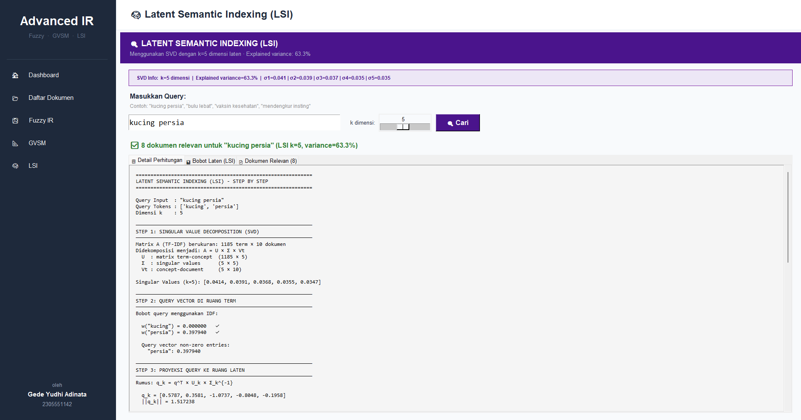

# Advanced Information Retrieval System



Aplikasi Information Retrieval menggunakan metode pencarian tingkat lanjut untuk menemukan dokumen teks yang relevan berdasarkan query yang dimasukkan. Program ini menampilkan perhitungan matematis secara mendetail pada setiap langkahnya.

## Metode

1. Fuzzy Information Retrieval
   Menggunakan derajat keanggotaan untuk merepresentasikan relevansi antara term dalam query dengan dokumen berdasarkan nilai TF-IDF.

2. Generalized Vector Space Model (GVSM)
   Perluasan ruang vektor yang memperhitungkan korelasi antar term, sehingga vektor term diproyeksikan ke dalam ruang dokumen (minterm).

3. Latent Semantic Indexing (LSI)
   Menerapkan dekomposisi matriks Singular Value Decomposition untuk mereduksi dimensi dan menangkap struktur semantik tersembunyi antar kata.

## Kebutuhan Sistem

- Python 3.x
- Tkinter
- NumPy
- Sastrawi

## Instalasi

Pastikan Python sudah terinstal di sistem. Instal dependensi yang dibutuhkan dengan perintah berikut:

```bash
pip install -r requirements.txt
```

## Cara Menjalankan

Buka terminal atau command prompt. Masuk ke direktori proyek dan jalankan file utama dengan perintah:

```bash
python main.py
```

Aplikasi berbasis GUI akan terbuka. Pilih metode yang ingin digunakan dari menu samping dan masukkan query pencarian.
